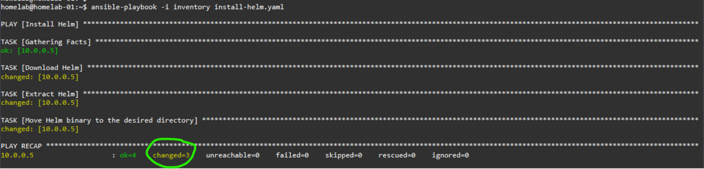
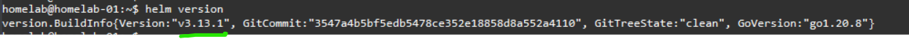

### Install Helm binary on GCE VM ubuntu 

1. Make sure you have passwordless ssh setup .

2. In this case we have used a local server account named homelab to install helm package and run playbook , as avoid using root user.

3. Below shows Execution of playbook 

4. Verification of helm package installed: 

